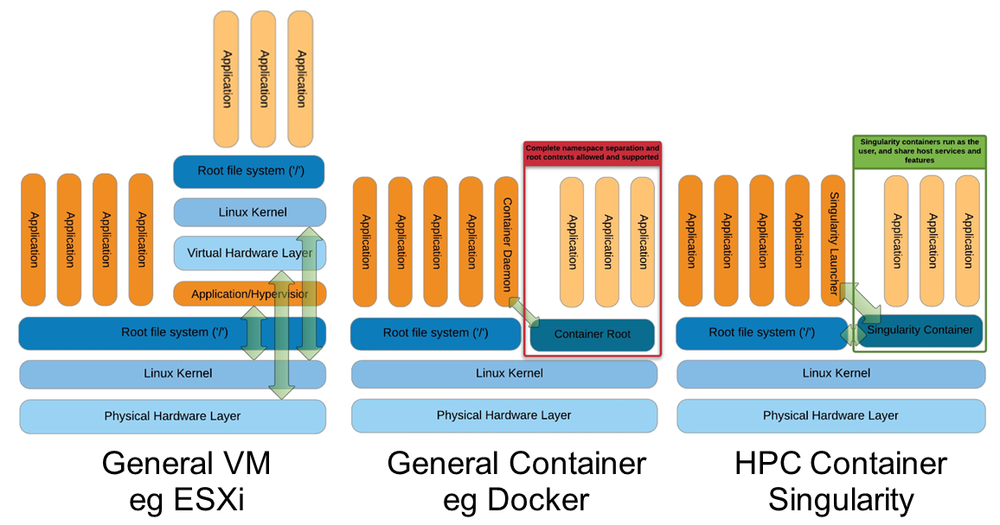
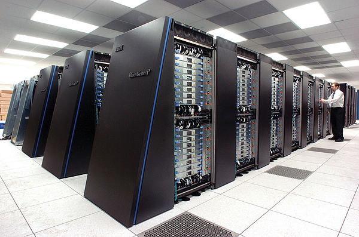

## Command-line tools in bioinformatics

- A large proportion of bioinformatics tools are available only on the command line. Moreover, even for tools equipped with a graphical user interface (e.g. BLAST, clustal, ...) the use of command-line can be necessary for some projects

- Enables to automate the tasks

    - Managing repetitive processes: apply the same task to numerous data files or with many different options
    - Managing complex processes combining many tasks (workflows)

- High performance computing (HPC)

    - running tasks that require huge resources of computing and storage

- Traceability, reproducibility, reusability

    - traceability: keeping track of each step and parameter used to produce a result 
    - reproducuibility; enabling to re-run the analysis and reproduce the same results
    - reusability: enabling to run the same analysis with different data

## Working environments

Most bioinformatics tools can be installed on Unix-like operating systems (Linux, Mac OS X), and can be used in different environments. 

- Terminal of your own computer (Linux, Mac OS X)
- Virtual Machine (e.g. [VirtualBox](https://www.virtualbox.org/), [VWMare](https://www.vmware.com/))
- Containers ([Docker](https://www.docker.com/), [singularity](https://www.sylabs.io/singularity/))
- Terminal of a remote computer (via an `ssh` connection)
- Bureau Virtuel

## Virtual machines

- Components

    - host: can be your own computer (note: also used to deploy services on HPC computers)
    - host operating system (Linux, Mac, Windows)
    - virtual machine (VM) : emulation of an other computer, that runs on the host machine
    - operating system of the VM: Linux, Windows, ...
    - hypervisor (= monitor): software that runs the virtual machines on the host

- Typical applications

    - run a Linux OS on a Windows or Macintosh PC
    - test a software under different operating systems
    - isolate a service from the host system (security, resource segmentation)

- Examples of hypervisors

    - VirtualBox (<https://www.virtualbox.org/>)
    - VWMare (<https://www.vmware.com/>)

## Container-based virtualisation

- Applications run on a shared operating system without requiring a virtual machine

- Advantages

    - modular combination of applications and libraries ("à la carte")
    - less resource-consuming than virtual machines

- Container management software

    - Docker (<https://www.docker.com/>)
    - singularity (<https://www.sylabs.io/singularity/>)

## Virtual machines versus containers

**Comparaison of virtualisation solutions.** Right: Virtual Machine; Center: Docker container; right: Singularity container. Source: Greg Kurtzer keynote at HPC Advisory Council 2017 @ Stanford

## Installation of software tools in the local operating system

- Advantages

    - Immediate availability of the tools
    - Direct invocation by the native operating system (more efficient)

- Weaknesses

    - Dependences (system libraries, language libraries, other executables)
    - Incompatibilities between dependences of different tools
    - The installation of some tools and libraries requires admin rights
    - OS-dependency of package managers ([package managers](https://en.wikipedia.org/wiki/Package_manager)): apt-get, yum, ports, brew, ...
    - Some applications and libraries are available only on some package managers. 

## Conda packages

- Doc : <https://conda.io/docs/>

- Advantages

    - A multi-platform package manager (Linux, Mac OS X, Windows)
    - All the installations can be done at the user-level (no need to be admin)
    - Community project supported by a large community (computer scientists, statisticians, bioinformaticians, ...) $\rightarrow$ ever-increasing number of supported tools an libraries 
    - Continuous integration $\rightarrow$ very fast response to requests
    - Very precise management of the dependencies and version
    - Seamingless management of uninstallation for no more required software
    - Trying it is adopting it!

- Weaknesses

    - If each used installs each tool and dependencies in her/his own account, this creates redundancy and waste of storage space.

## Computer cluster

A cluster is a set of computers (denotes as **nodes**) that work together and can be seen as a single system. Clusters are generally used to run parallel computing

**Grappe de serveurs.** En avant-plan: *Homo sapiens* tentant d'établir une interaction physique avec les machines.  Source: <https://en.wikipedia.org/wiki/Parallel_computing>

## Parallel computing

Parallel computing consists in running simultaneously a series of processes on a computer system. 

Tasks can be distributed on several Computer Processing Units (**CPUs**) of a same computer and/or on several computers (cluster).

The distribution of tasks on nodes and CPUs relies on a **job scheduler**. Users submit jobs (in the form of command lines or scripts) to the scheduler, which manages their execution on the different nodes and CPUs. 

